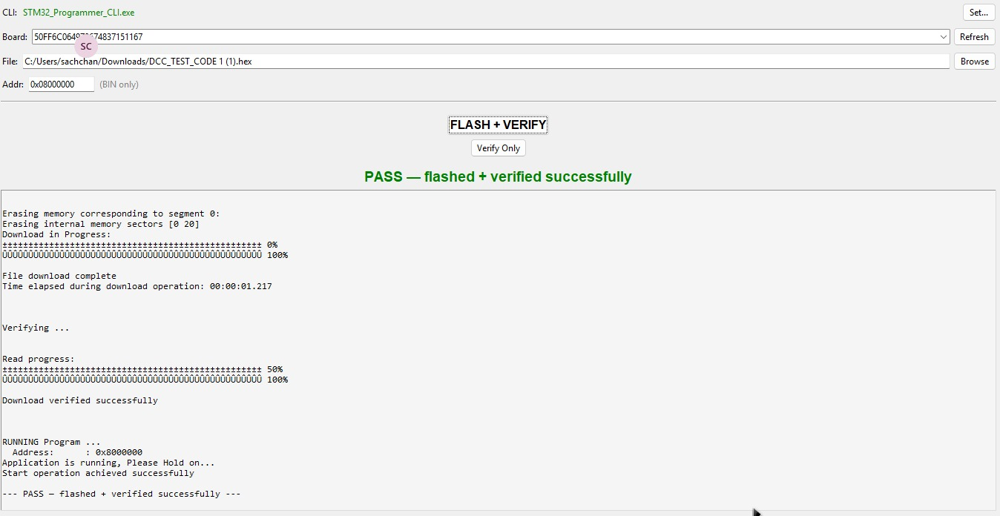

# STM32 Flash Tool

Lightweight, cross-platform GUI tool for flashing STM32 microcontrollers in mass production.

**Single file. Zero dependencies. Double-click to run.**


## Features

- ⚡ **Flash + Verify** — one click writes firmware, verifies it, and starts execution
- 🔍 **Verify Only** — re-check an already-flashed chip without re-writing
- 🧵 **Non-blocking** — all operations run in background threads, UI never freezes
- 🔌 **Auto-detection** — finds ST-LINK probes and STM32CubeProgrammer CLI automatically
- 🪟🐧 **Cross-platform** — Windows and Linux
- 📦 **Self-bootstrapping** — auto-installs missing system packages on Linux
- 💾 **Remembers settings** — CLI path, flash address, last directory

## Screenshot



## Prerequisites

### Required (either way)
- **STM32CubeProgrammer CLI** — [Download from ST.com](https://www.st.com/en/development-tools/stm32cubeprog.html)

### To run the `.py` file directly
- **Python 3.7+** — [Download from python.org](https://python.org)
- tkinter ships with Python on Windows. On Linux, the app auto-installs it.

### To run the standalone `.exe` / binary
- Nothing. Just the file.

## Quick Start

### Option A: Download from GitHub Releases (no Python needed)

1. Go to [Releases](https://github.com/sakthiasthik/stm32_flash_tool/releases)
2. Download the latest:

| File | Platform | Size |
|------|----------|------|
| `STM32-Flasher.exe` | Windows | ~13 MB |
| `STM32-Flasher` | Linux | ~28 MB |

**Windows:** Double-click `STM32-Flasher.exe`.

**Linux:**
```bash
chmod +x STM32-Flasher    # ⚠️ Required after download from web
./STM32-Flasher
```

> **Why `chmod +x`?** Files downloaded from the web lose the execute permission on Linux. This is normal — every Linux binary from GitHub needs this.

### Option B: Run the Python file directly

```bash
python3 stm32_flasher.py
```
Requires Python 3.7+. On Linux, the app auto-installs `python3-tk` if missing.

### Option C: Build from source

**Windows:**
```cmd
pip install pyinstaller
build.bat
```
Output: `dist\STM32-Flasher.exe`

**Linux:**
```bash
pip install pyinstaller
bash build.sh
```
Output: `dist/STM32-Flasher`

## How It Works

```
User clicks Flash + Verify
        │
        ▼
STM32_Programmer_CLI -c port=SWD sn=<SN> -w firmware.bin 0x08000000 -v -g
        │                              │         │            │  │
        │                              │         │            │  └── run after flash
        │                              │         │            └── verify
        │                              │         └── write firmware
        │                              └── connect to probe
        └── CLI executable
```

| Button | CLI Flags | Use Case |
|--------|-----------|----------|
| **Flash + Verify** | `-w file [addr] -v -g` | Production — write, verify, run |
| **Verify Only** | `-v file [addr]` | Spot-check without re-flashing |

## File Structure

```
stm32_flash_tool/
├── stm32_flasher.py      ← The app (~370 lines, stdlib only)
├── STM32flash_gui.py     ← Legacy version (reference)
├── build.bat             ← Build Windows .exe
├── build.sh              ← Build Linux binary
├── icon.png / icon.ico   ← App icons
├── screenshot.jpeg       ← Screenshot
├── README.md
├── LICENSE
└── .gitignore
```

## Config

Settings are auto-saved to `~/.stm32flasher.json`:

```json
{
  "cli_path": "/opt/st/.../STM32_Programmer_CLI",
  "flash_address": "0x08000000",
  "last_dir": "/home/user/firmware"
}
```

No settings UI — it just works.

## License

MIT — see [LICENSE](LICENSE)
